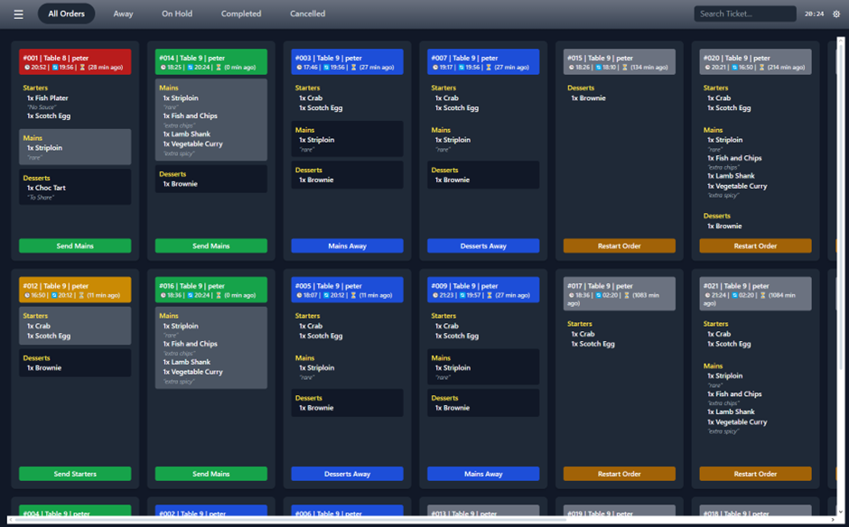
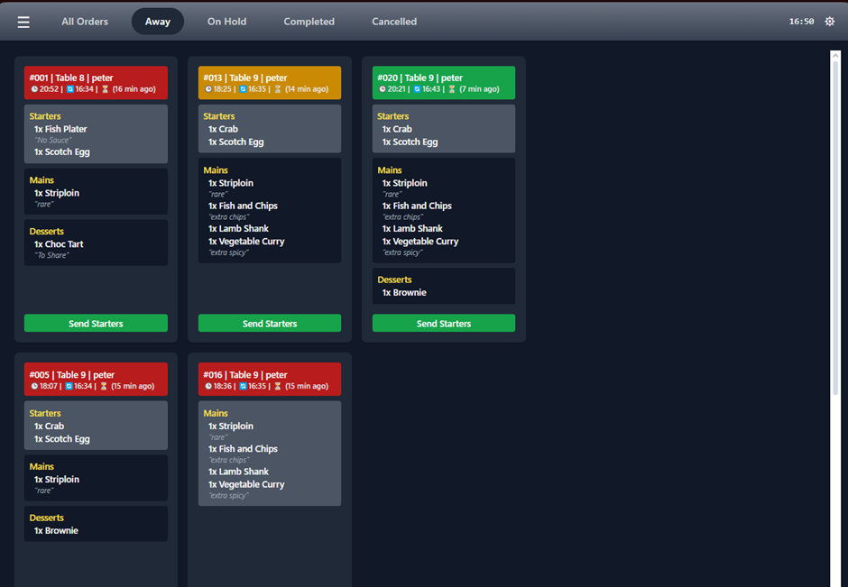
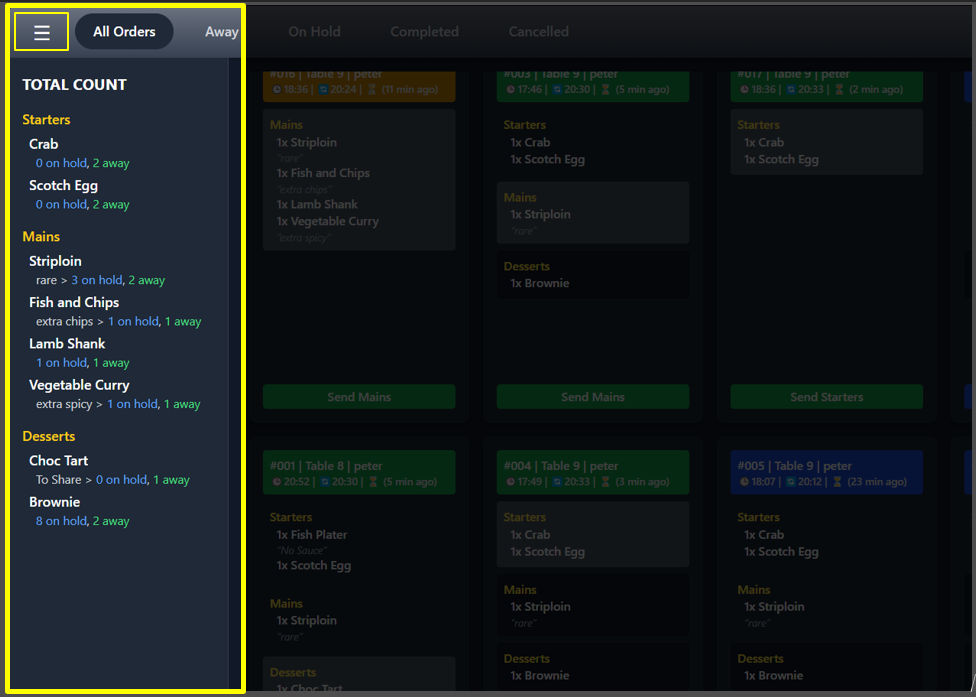
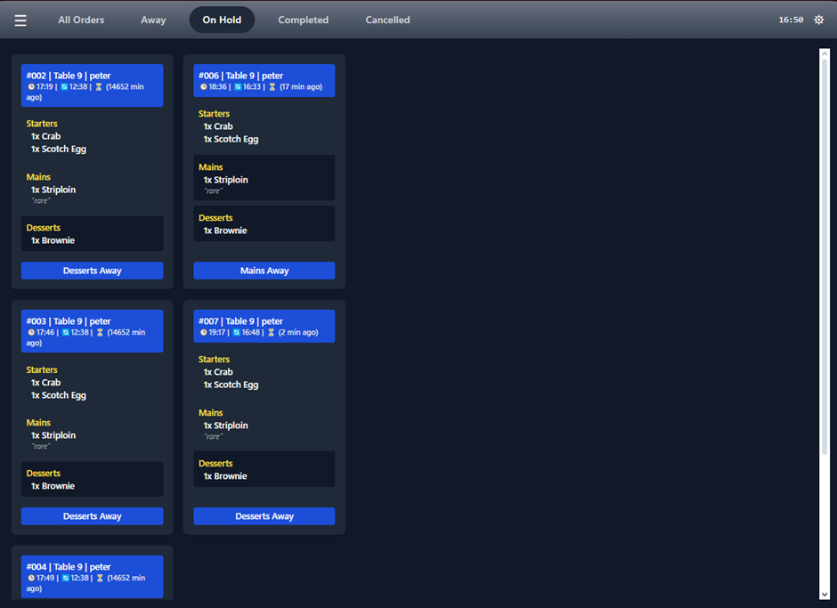
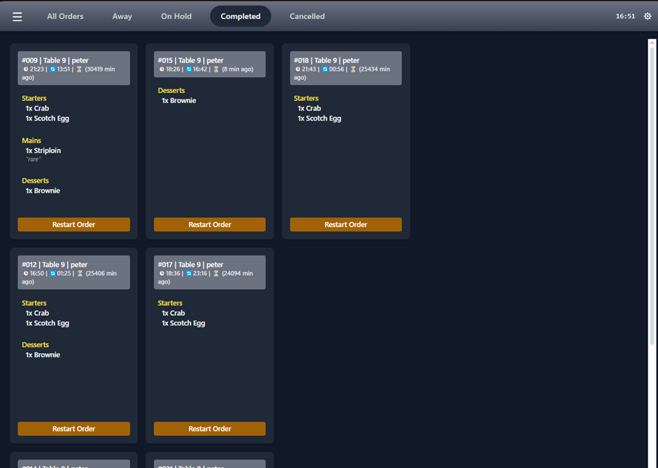
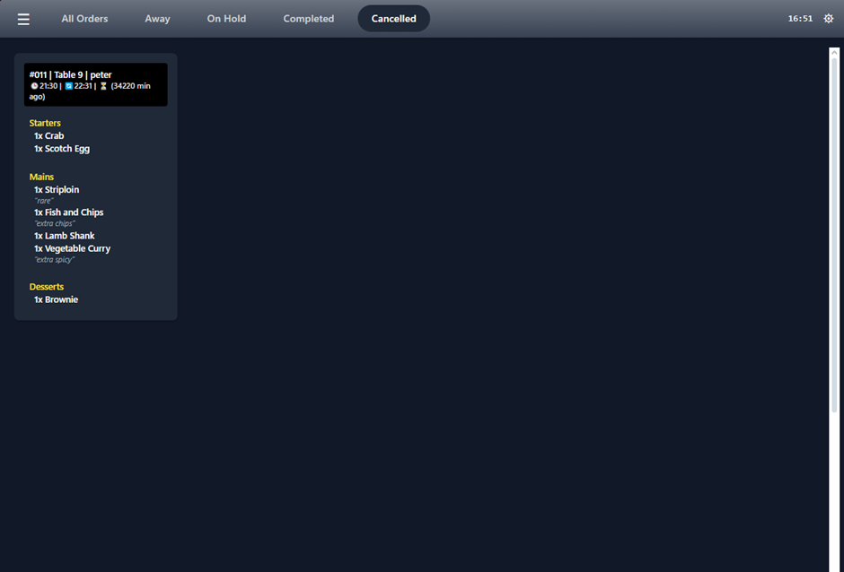
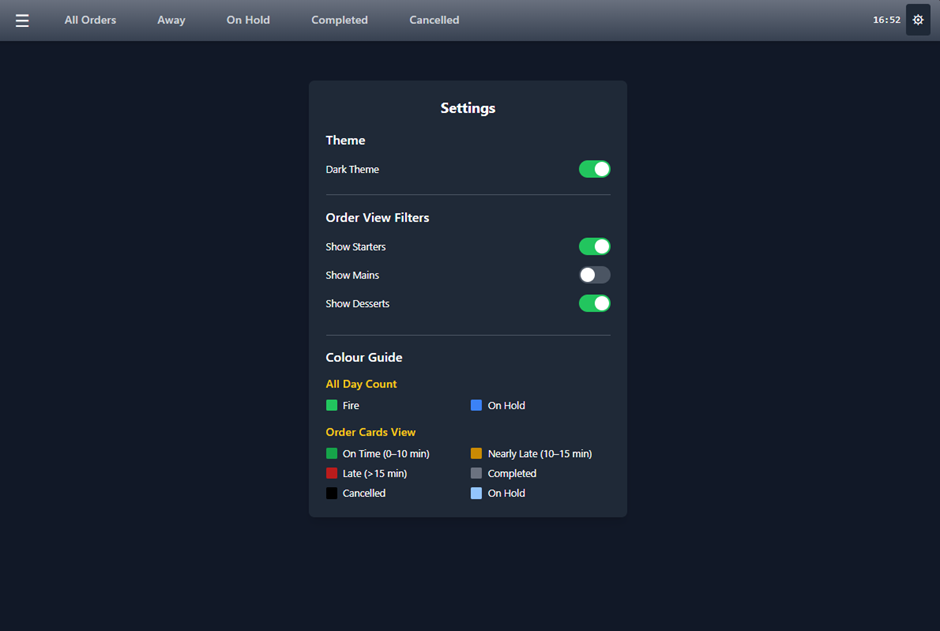

# KitchnSync


#  KitchnSync – Real-Time Kitchen Display System (KDS)

KitchnSync is a full-stack web-based Kitchen Display System (KDS) designed specifically for the Irish Restaurant Sector. It provides real-time updates for kitchen staff to manage food orders, reduce communication errors, and streamline service.

The system features a React frontend and Node.js backend, using Socket.io for live updates and MongoDB for data storage.

---

## Project Structure

---

## ✅ Prerequisites

Before running the project, make sure you have:

- Node.js (v18+)
- npm
- MongoDB Atlas (or local MongoDB)
- Git (optional)

---

## 🚀 Getting Started

### 1. Clone the Repository

```bash
git clone https://github.com/your-username/KitchnSync.git
cd KitchnSync
```
### 2.  Set Up the Backend
```bash
cd backend
npm install
```
Create a .env file in the backend/ directory with the following content:
```bash
PORT=5000
MONGO_URI=mongodb+srv://<username>:<password>@<cluster>.mongodb.net/kitchnsync
npm run dev 
```
3. Set Up the Frontend
```bash
cd frontend
npm install
npm run dev
```

 Deployment

 http://54.226.219.54

 ##To Run Tests
```bash
 cd backend
npm test
```
## All Orders Page

## Away Page

## Total Count Sidebar

## Away Page

## Completed Page

## Cancelled Page

## Settings Page
